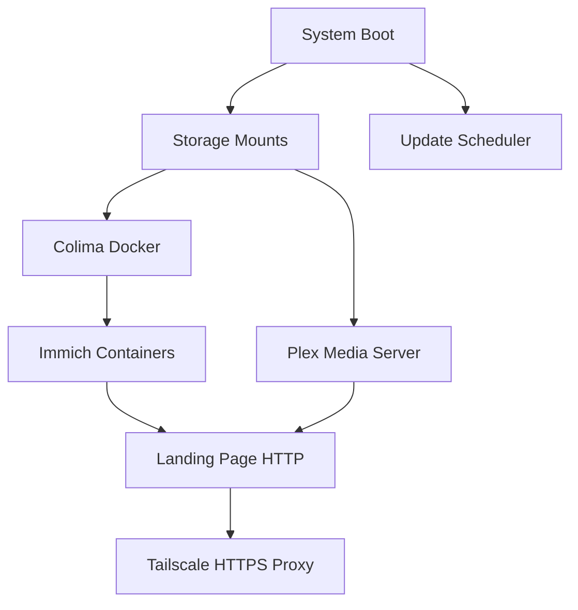

# 🤖 Automation & LaunchD Guide

Complete guide for understanding and managing the automated services, scheduled tasks, and system maintenance on your Mac mini home server.

---

## 🎯 **Current Automation Status**

### **✅ What Automation is Already Running**

Your home server has **Enhanced Option C automation** installed and active. This provides secure, graceful automation with intelligent fallback handling.

#### **🔄 Automatic Boot Recovery**
When your Mac mini reboots, the following happens automatically:

**Immediate (0-30s after login):**
- 🔧 **Storage service** checks and creates mount points (`/Volumes/Media`, `/Volumes/Photos`, `/Volumes/Archive`)
- 🌐 **Tailscale service** maintains VPN connectivity  
- 📊 **Update check service** monitors for system updates

**Infrastructure Startup (30-90s):**
- 🐳 **Colima service** starts Docker runtime for containers
- 📸 **Immich service** deploys photo management containers
- 💾 **Storage verification** ensures all mount points are accessible

**Application Startup (90-150s):**
- 🎬 **Plex service** starts Media Server with HTTPS re-enablement
- 🌐 **Landing page service** starts HTTP server and configures Tailscale HTTPS serving

#### **🛡️ Enhanced Option C Features**
- **Graceful Permission Handling**: Services attempt `sudo` operations but provide manual recovery commands if they fail
- **Dependency-Aware Timing**: Services start in the correct order with appropriate delays
- **Self-Healing Scripts**: Each service includes error detection and recovery logic
- **Comprehensive Logging**: All automation logs to `/tmp/*.{out,err}` for monitoring
- **Manual Recovery Support**: `post_boot_health_check.sh --auto-recover` for additional recovery

#### **📋 Active LaunchD Services**
```bash
# View all homelab automation:
launchctl list | grep homelab

# Monitor real-time logs:
tail -f /tmp/{storage,colima,immich,plex,landing}.{out,err}
```

#### **⏰ Automation Timeline**
```
SYSTEM BOOT → USER LOGIN → LaunchAgents Start
    ↓
  0s: 🌐 Tailscale + 📊 Update Check (immediate)
    ↓
 30s: 🔧 Storage Mounts (ensure_storage_mounts.sh)
    ↓  
 60s: 🐳 Colima Docker (21_start_colima.sh)
    ↓
 90s: 📸 Immich Containers (compose_helper.sh)
    ↓
120s: 🎬 Plex Media Server (start_plex_safe.sh)
    ↓
150s: 🌐 Landing Page + HTTPS (37_enable_simple_landing.sh)
    ↓
🎉 ALL SERVICES OPERATIONAL
```

#### **🚀 When Automation Triggers**
- **System Boot**: All services start automatically after login
- **Service Failures**: LaunchD restarts failed services (when `KeepAlive=true`)
- **Manual Recovery**: Run health check for immediate assessment/recovery
- **Scheduled Tasks**: Update checks run weekly (configurable)

#### **🏥 Health Check & Recovery**
```bash
# Check system status:
./scripts/post_boot_health_check.sh

# Automatic recovery for any issues:
./scripts/post_boot_health_check.sh --auto-recover
```

#### **👀 What to Expect After Reboot**
1. **Login to your Mac mini** → LaunchAgents activate automatically
2. **Wait 2-3 minutes** → All services start in sequence
3. **Check status**: Run `./scripts/post_boot_health_check.sh`
4. **Access services**:
   - 📍 **Landing Page**: https://YOUR-DEVICE.YOUR-TAILNET.ts.net
   - 📸 **Immich**: https://YOUR-DEVICE.YOUR-TAILNET.ts.net:2283
   - 🎬 **Plex**: https://YOUR-DEVICE.YOUR-TAILNET.ts.net:32400

#### **🔧 If Something Doesn't Start**
The Enhanced Option C system provides graceful fallback:
- Services that need `sudo` will show manual commands if automation fails
- Run `./scripts/post_boot_health_check.sh --auto-recover` for automatic fixes
- Check logs: `tail -f /tmp/{storage,colima,immich,plex,landing}.{out,err}`

---

## 📚 **Setup & Configuration Guide**

*The following sections describe how to set up, modify, or troubleshoot the automation system.*

## 📋 Overview

Automation includes:
- **🚀 Auto-start services**: Boot-time startup of essential services
- **📅 Scheduled maintenance**: Weekly update checks and cleanup
- **🔄 Service management**: Dependency handling and health monitoring
- **🛡️ Error recovery**: Automatic restart on failures

---

## 🚀 Auto-Start Services

### LaunchD Configuration

**Install all automation**:
```bash
sudo ./scripts/40_configure_launchd.sh
```

### Enhanced Service Hierarchy



**Enhanced Boot Sequence** (with timing):
1. **0s - Boot**: System startup triggers LaunchDaemons
2. **30s - Storage**: Create mount points and symlinks (`ensure_storage_mounts.sh`)
3. **60s - Colima**: Start Docker runtime (`21_start_colima.sh`)
4. **90s - Immich**: Start photo service containers (`compose_helper.sh`)
5. **120s - Plex**: Start native media server with conflict handling (`start_plex_safe.sh`)
6. **150s - Landing + Tailscale**: Start HTTP server and configure HTTPS proxies (`37_enable_simple_landing.sh`)

---

## 📋 Installed Services

### **io.homelab.colima.plist** - Docker Runtime

**Purpose**: Ensures Docker/Colima starts automatically on boot

```xml
<?xml version="1.0" encoding="UTF-8"?>
<!DOCTYPE plist PUBLIC "-//Apple//DTD PLIST 1.0//EN" "http://www.apple.com/DTDs/PropertyList-1.0.dtd">
<plist version="1.0">
<dict>
    <key>Label</key>
    <string>io.homelab.colima</string>
    <key>RunAtLoad</key>
    <true/>
    <key>KeepAlive</key>
    <dict>
        <key>SuccessfulExit</key>
        <false/>
    </dict>
</dict>
</plist>
```

**Management**:
```bash
# Check status
sudo launchctl print system/io.homelab.colima

# Restart
sudo launchctl kickstart system/io.homelab.colima

# Stop
sudo launchctl unload /Library/LaunchDaemons/io.homelab.colima.plist
```

---

### **io.homelab.compose.immich.plist** - Photo Service

**Purpose**: Auto-starts Immich containers after Colima is ready

**Dependencies**:
- Requires Colima to be running
- Waits for Docker socket availability
- Monitors container health

**Management**:
```bash
# Check Immich service status
sudo launchctl print system/io.homelab.compose.immich

# Manual restart
cd services/immich && docker compose restart
```

---

### **io.homelab.updatecheck.plist** - Maintenance

**Purpose**: Weekly automated update checks

**Schedule**: Every Sunday at 2:00 AM
```xml
<key>StartCalendarInterval</key>
<dict>
    <key>Weekday</key>
    <integer>0</integer>
    <key>Hour</key>
    <integer>2</integer>
    <key>Minute</key>
    <integer>0</integer>
</dict>
```

**What it does**:
- Checks for Homebrew updates
- Checks for Docker image updates  
- Checks for macOS updates
- Generates update report
- Logs results to `/tmp/update-check.log`

**Manual execution**:
```bash
./scripts/80_check_updates.sh
./scripts/80_check_updates.sh --apply  # Apply updates
```

---

### **io.homelab.tailscale.plist** - VPN Service *(Optional)*

**Purpose**: Auto-starts Tailscale VPN connection

**Conditions**:
- Only installed if Tailscale is present
- Waits for network connectivity
- Preserves previous connection settings

**Management**:
```bash
# Check Tailscale status
tailscale status

# Manual control
sudo tailscale up --accept-dns=true
sudo tailscale down
```

---

## 🚀 Enhanced Recovery Services

### **io.homelab.storage.plist** - Storage Mount Management

**Purpose**: Ensures proper mount point structure for interim configuration

**What it does**:
- Waits for `/Volumes/warmstore` to be available
- Creates `/Volumes/Media/Movies` → `/Volumes/warmstore/Movies` symlink
- Creates `/Volumes/Media/TV` → `/Volumes/warmstore/TV Shows` symlink  
- Creates `/Volumes/Photos` → `/Volumes/warmstore/Photos` symlink
- Creates `/Volumes/Archive` placeholder directory

**Management**:
```bash
# Manual execution
./scripts/ensure_storage_mounts.sh

# Check mount status
ls -la /Volumes/Media/ /Volumes/Photos /Volumes/Archive
```

### **io.homelab.plex.plist** - Native Plex Service

**Purpose**: Auto-starts Plex Media Server with Tailscale conflict handling

**Features**:
- Checks if Plex already running
- Temporarily disables Tailscale port 32400 proxy during startup
- Waits for Plex to bind to port 32400
- Handles startup conflicts gracefully

**Management**:
```bash
# Manual safe startup
./scripts/start_plex_safe.sh

# Check Plex status
curl -I http://localhost:32400
```

### **io.homelab.landing.plist** - Landing Page HTTP Server

**Purpose**: Serves the simple landing page via Python HTTP server

**Features**:
- Starts Python HTTP server on `localhost:8080`
- Serves `web/index.html` with service links
- Kills any existing HTTP server on port 8080
- Runs in background with proper logging

**Management**:
```bash
# Manual startup
./scripts/37_enable_simple_landing.sh

# Check server status
curl -I http://localhost:8080
```

### **io.homelab.tailscale.serve.plist** - HTTPS Proxy Configuration

**Purpose**: Configures Tailscale HTTPS proxies for all services

**Features**:
- Waits for all services (Immich, Plex, Landing Page) to be ready
- Configures `https://hostname/` → `http://localhost:8080` (Landing Page)
- Configures `https://hostname:2283` → `http://localhost:2283` (Immich)
- Configures `https://hostname:32400` → `http://localhost:32400` (Plex)

**Management**:
```bash
# Manual configuration
./scripts/37_enable_simple_landing.sh

# Check serving status
sudo tailscale serve status
```

---

## 🔧 Service Management

### Health Monitoring

**Check all services**:
```bash
# List homelab services
launchctl list | grep homelab

# Detailed status for specific services
launchctl print gui/$(id -u)/io.homelab.colima
launchctl print gui/$(id -u)/io.homelab.compose.immich
```

**Service logs**:
```bash
# View service logs
sudo log show --predicate 'subsystem == "io.homelab.colima"' --last 1h

# Real-time monitoring
sudo log stream --predicate 'subsystem BEGINSWITH "io.homelab"'
```

### Manual Control

**Start/stop individual services**:
```bash
# Stop service
sudo launchctl unload /Library/LaunchDaemons/io.homelab.colima.plist

# Start service
sudo launchctl load /Library/LaunchDaemons/io.homelab.colima.plist

# Restart service
sudo launchctl kickstart system/io.homelab.colima
```

**Emergency stop all**:
```bash
sudo launchctl unload /Library/LaunchDaemons/io.homelab.*
```

### Dependency Management

**Service dependencies**:
```bash
# Colima must be running for Immich
sudo launchctl print system/io.homelab.colima | grep State

# Check Docker availability before starting Immich
docker ps > /dev/null 2>&1 && echo "Docker ready"
```

---

## 📅 Scheduled Maintenance

### Update Checking

**Automated weekly checks**:
- **Schedule**: Sunday 2 AM
- **Scope**: Homebrew, Docker images, macOS
- **Output**: `/tmp/update-check.log`
- **Action**: Check only (manual apply)

**Manual update process**:
```bash
# Check for updates
./scripts/80_check_updates.sh

# Review available updates
cat /tmp/update-check.log

# Apply updates when ready
./scripts/80_check_updates.sh --apply
```

### Custom Maintenance Tasks

**Add custom scheduled task**:

1. **Create script** (`scripts/custom_maintenance.sh`):
```bash
#!/bin/bash
# Custom maintenance script  
echo "$(date): Running custom maintenance" >> /tmp/custom_maintenance.log

# Example maintenance tasks (customize as needed)
./scripts/80_check_updates.sh >> /tmp/custom_maintenance.log
./diagnostics/check_raid_status.sh >> /tmp/custom_maintenance.log
./diagnostics/check_docker_services.sh >> /tmp/custom_maintenance.log
```

2. **Create LaunchD plist** (`launchd/io.homelab.custom.plist`):
```xml
<?xml version="1.0" encoding="UTF-8"?>
<!DOCTYPE plist PUBLIC "-//Apple//DTD PLIST 1.0//EN" "http://www.apple.com/DTDs/PropertyList-1.0.dtd">
<plist version="1.0">
<dict>
    <key>Label</key>
    <string>io.homelab.custom</string>
    <key>ProgramArguments</key>
    <array>
        <string>__HOME__/Documents/home-server/scripts/custom_maintenance.sh</string>
    </array>
    <key>StartCalendarInterval</key>
    <dict>
        <key>Hour</key>
        <integer>3</integer>
        <key>Minute</key>
        <integer>0</integer>
    </dict>
</dict>
</plist>
```

3. **Install**:
```bash
sudo cp launchd/io.homelab.custom.plist /Library/LaunchDaemons/
sudo launchctl load /Library/LaunchDaemons/io.homelab.custom.plist
```

---

## 🔄 Error Recovery

### Automatic Restart

**KeepAlive configuration**:
```xml
<key>KeepAlive</key>
<dict>
    <key>SuccessfulExit</key>
    <false/>
    <key>NetworkState</key>
    <true/>
</dict>
```

**Behavior**:
- Restart on unexpected exit
- Wait for network availability
- Limit restart attempts

### Manual Recovery

**Service crashed**:
```bash
# Check what happened
sudo log show --predicate 'subsystem == "io.homelab.colima"' --last 1h

# Restart service
sudo launchctl kickstart system/io.homelab.colima
```

**Complete reset**:
```bash
# Stop all services
sudo launchctl unload /Library/LaunchDaemons/io.homelab.*

# Clean restart
colima delete && colima start
cd services/immich && docker compose up -d

# Reload services
sudo launchctl load /Library/LaunchDaemons/io.homelab.*
```

---

## 🔍 Monitoring & Logging

### Log Locations

**System logs**:
```bash
# LaunchD logs
sudo log show --predicate 'subsystem BEGINSWITH "io.homelab"'

# Service-specific logs
sudo log show --predicate 'subsystem == "io.homelab.colima"' --last 1h
```

**Application logs**:
```bash
# Colima logs
colima logs

# Docker logs
cd services/immich && docker compose logs

# Update check logs
cat /tmp/update-check.log
```

### Performance Monitoring

**Resource usage**:
```bash
# Check system load
top -l 1 | head -10

# Service resource usage
ps aux | grep -E "(colima|docker|immich)"

# Disk usage
df -h /Volumes/*
```

**Service health**:
```bash
# Quick health check
./diagnostics/run_all.sh

# Specific service checks
./diagnostics/check_docker_services.sh
./diagnostics/check_plex_native.sh
```

---

## 🛠️ Advanced Configuration

### Service Priorities

**Start order control**:
```xml
<!-- High priority (starts first) -->
<key>ProcessType</key>
<string>Background</string>
<key>Nice</key>
<integer>-10</integer>

<!-- Low priority (starts last) -->
<key>Nice</key>
<integer>10</integer>
```

### Resource Limits

**Memory and CPU limits**:
```xml
<key>HardResourceLimits</key>
<dict>
    <key>MemoryLimit</key>
    <integer>2147483648</integer>  <!-- 2GB in bytes -->
    <key>NumberOfFiles</key>
    <integer>1024</integer>
</dict>
```

### Environment Variables

**Pass environment to services**:
```xml
<key>EnvironmentVariables</key>
<dict>
    <key>PATH</key>
    <string>/usr/local/bin:/usr/bin:/bin</string>
    <key>HOME</key>
    <string>/Users/username</string>
</dict>
```

---

## 🔧 Troubleshooting

### Service Won't Start

**Check plist syntax**:
```bash
plutil -lint /Library/LaunchDaemons/io.homelab.colima.plist
```

**Check permissions**:
```bash
ls -la /Library/LaunchDaemons/io.homelab.*
# Should be: -rw-r--r--  1 root  wheel
```

**Check dependencies**:
```bash
# Ensure required binaries exist
which colima docker docker-compose
```

### Boot Issues

**Disable problematic service**:
```bash
sudo launchctl unload /Library/LaunchDaemons/io.homelab.problematic.plist
```

**Debug boot process**:
```bash
# View boot logs
sudo log show --predicate 'messageType == 16' --start "$(date -j -v-10M '+%Y-%m-%d %H:%M:%S')"
```

### Performance Issues

**High CPU usage**:
```bash
# Identify resource-heavy services
top -o cpu | head -20

# Adjust service priority
# Edit plist and add <key>Nice</key><integer>10</integer>
```

**Memory issues**:
```bash
# Check memory usage
vm_stat

# Add memory limits to plist
# Use HardResourceLimits as shown above
```

---

## 🔗 Related Documentation

- **📖 [Detailed Setup Guide](SETUP.md#phase-6-automation-setup)** - Initial automation setup
- **🤖 [LaunchD Jobs](../launchd/README.md)** - Service configuration details
- **🔧 [Troubleshooting Guide](TROUBLESHOOTING.md#emergency-recovery)** - Service recovery procedures
- **🔍 [Diagnostics](../diagnostics/README.md)** - Health monitoring tools
- **⚙️ [Environment Variables](ENVIRONMENT.md)** - Configuration reference

---

**Service automation issues?** Check the **🔧 [Troubleshooting Guide](TROUBLESHOOTING.md)** for recovery procedures and detailed debugging steps.
